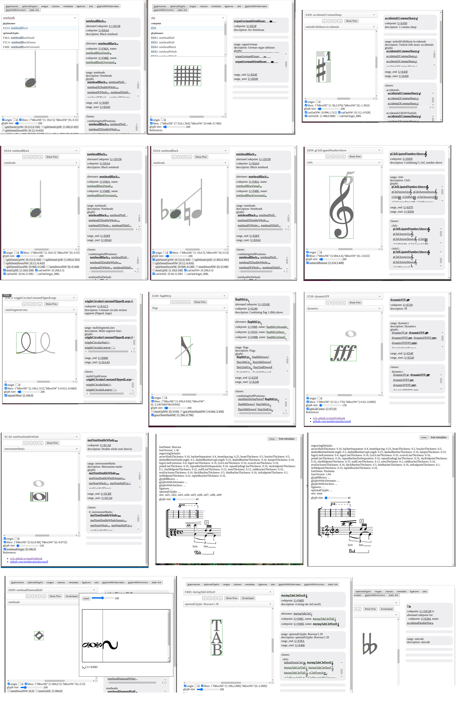
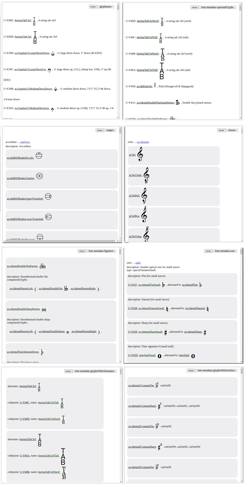

# smuflfontviewer

This demo shows SMuFL Metadata for a given character, plus some useful extended properties. For more information, see [Standard Music Font Layout specification](https://www.smufl.org/).

## supported properties
- SMuFL metadata:
  - glyphnames
  - ranges
  - classes
- font metadata:
  - engravingDefaults
  - optionalGlyphs
  - ligatures
  - sets
  - glyphBBoxes
  - glyphsWithAlternates
  - glyphsWithAnchors
    - splitStem:
      - splitStemUpSE
      - splitStemUpSW
      - splitStemDownNE
      - splitStemDownNW
    - stem:
      - stemUpSE
      - stemDownNW
      - stemUpNW
      - stemDownSW
    - graceNoteSlash
      - graceNoteSlashNW
      - graceNoteSlashSE
      - graceNoteSlashSW
      - graceNoteSlashNE
    - numeral:
      - numeralBottom
    - repeatOffset
    - noteheadOrigin
    - opticalCenter

Live demo: <https://h-sug1no.github.io/smuflfontviewer>

